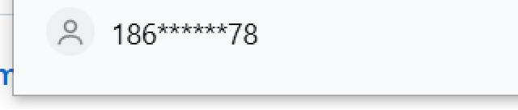
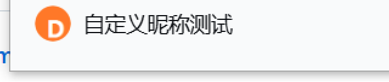
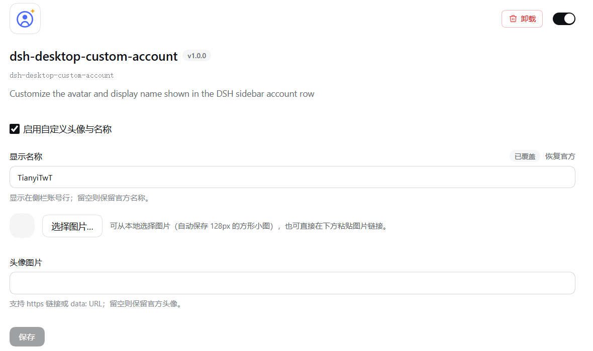

# dsh-desktop-custom-account

自定义 DSH 桌面版**侧栏左下角账号行**的头像与显示名称，配置入口在**这个插件自己的设置里**（插件页 → 已安装 → dsh-desktop-custom-account）。

官方账号行由 `@deepseek-ai/dsh-client-ui-settings-account` 渲染，头像和名称来自 DeepSeek Platform 的账号资料。本插件在浏览器端用一条跟随设置实时更新的样式表覆盖该行的呈现，因此不需要改动 DSH 安装目录里的任何文件。

| 官方默认 | 自定义之后 |
| --- | --- |
|  |  |

插件自己的页面（配置区就在这一页）：



## 使用

1. 左侧打开 **插件**，滚到 **已安装**，点开 `dsh-desktop-custom-account`。
2. 页面顶部的配置区就是本插件的设置（这里没有"官方插件卡片"，配置挂在安装包自己的页面上）：
   - **启用自定义头像与名称**：总开关，关闭即完全恢复官方显示。
   - **显示名称**：显示在侧栏账号行；留空则保留官方名称。
   - **头像图片**：可从本地选择图片（自动裁成 128px 方形小图，有透明通道存 PNG，否则存 JPEG，通常几 KB），也可以直接粘贴 `https:` 链接或 `data:` URL。
   - 点 **保存** 后立即生效；「恢复官方」按钮清除该字段的覆盖值。
3. 设置值由 Host 的设置文档持久化，写进 profile 的 `cordis.patch.yml`（和官方账号引导、外观等偏好同一种机制），重启后仍保留。

## 插件名称与图标

插件在「已安装」里的显示名/描述/图标由包自己的展示元信息决定：

| 内容 | 来源 |
| --- | --- |
| 标题、描述 | `locale/en.json`、`locale/zh.json` 里的 `meta.title` / `meta.description`（按界面语言取，缺失时回退到 `package.json` 的 `name` / `description`） |
| 图标 | `package.json` 的 `icon` 指向的 SVG/PNG/JPEG/WebP（≤256 KiB，必须在包目录内） |

修改这两处的成本很低；注意 Host 在应用启动时读取并缓存包的解析信息，**改完名称后需要重启应用**才会显示（图标走 manifest 文件读取，重新进入插件页即可看到）。

## 当前安装状态

已经安装并启用到 `desktop` profile：

- `~/.dsh/profiles/desktop/package.json` 依赖：`dsh-desktop-custom-account: link:F:/WorkSpace/DeepSeek-Harness-Plugins/dsh-desktop-custom-account`
  - 用 `link:`（而不是 `file:`）是有意的：`file:` 会被 pnpm 复制成一份快照，之后改工作区源码不会反映到运行中的应用；`link:` 是指向本目录的联接，工作区始终是唯一源。
- `dsh.profile.bundles` 追加 `dsh-desktop-custom-account`
- 插件自身的 patch（`cordis.patch.yml`）插入 Loader 条目 `id: custom-account`

## 工作原理

一个包同时提供 Host 半侧与浏览器半侧：

- **Host 半侧** `lib/index.js`：空实现，只为占一条 Loader 条目，并声明 3 个 `volatile()` 字段（`enabled` / `displayName` / `avatar`）。`volatile` 是关键 —— 设置文档只把 volatile 字段当作可在线编辑的偏好暴露给客户端，命名空间就是条目 id `custom-account`。
- **浏览器半侧** `lib/client.js`（手写的客户端 bundle）：
  1. 用 `ctx.configForms.get("custom-account")` 绑定该命名空间，用 `@deepseek-ai/dsh-client-ui-primitives` 的 `SettingsFormModel` + `SettingsForm` 把设置注册进 **`plugins.bundle.config`**（键 = 包名 `dsh-desktop-custom-account`），也就是这个安装包自己页面上的配置区；
  2. 订阅同一份设置快照，把配置编译成一条 `<style data-plugin-css="dsh-desktop-custom-account/live.css">` 插入页面：
     - 名称：`[data-slot="settings.launcher"] button[aria-haspopup="menu"][data-signed-out="false"][data-collapsed="false"] > span:last-child`
     - 头像：`… [data-signed-out="false"] > span:first-child`（`background-image` + 隐藏内部图标）
  3. 配置清空或关闭开关时样式表被清空，官方行原样恢复（无需任何 DOM 手术）。

### 为什么用样式覆盖而不是注册槽位

`settings.launcher` 是 `single` 槽位，官方账号插件已经占用它，槽位注册表对第二个注册直接抛错（会连带破坏登录/账号页）。而账号资料本身属于 Platform 侧数据。所以本插件选择「在槽位锚点上做纯 CSS 覆盖」：`data-slot` 锚点由渲染器生成，不受 React 重渲染影响，也不需要 MutationObserver。

## 开发与调试

- 工作区即运行中的源码（profile 用 `link:` 联接本目录）。
- 改 `lib/client.js`（浏览器半侧）：Host 会在挂载时对客户端 bundle 做快照，所以改完需要让该条目重新挂载 —— 在插件页把这个插件**关掉再打开**，或重启应用。
- 改 `lib/index.js`（Host 半侧）：同样关掉再打开插件，或重启应用。
- 改 `locale/*.json`、`package.json` 的 `icon`/名称：重启应用后生效。
- 条目 id `custom-account` 同时是设置命名空间：如果改它，需要同时改 `cordis.patch.yml` 与 `lib/client.js` 里的 `ENTRY_ID`。

这个仓库只包含插件本体。开发时用到的一批本地助手脚本（读取 `app.asar` 查官方实现、窗口截图、窗口内点击/滚轮）留在工作区、不入库：它们只服务于本机调试，其中接管鼠标的那两个尤其不适合随插件发布。

## 卸载

在插件页把该 bundle 关闭，或手动移除：

```powershell
cd C:\Users\TianyiTwT\.dsh\profiles\desktop
pnpm remove dsh-desktop-custom-account
# 并从 package.json 的 dsh.profile.bundles 与 cordis.patch.yml 的 custom-account 覆盖项中删除
```

## 已知限制

- 覆盖针对官方账号行的 DOM 结构（槽位锚点 + 触发器按钮 + 两个 span）。DSH 升级后若官方改版结构，选择器可能需要同步更新。
- 只影响侧栏左下角那一行；「设置 → 账号」页里的账号资料不受影响（那是 Platform 数据）。
- 头像以 data URL 形式存进设置文档，已自动压缩到 128px；仍不建议存超大图。
- 未登录状态下显示的是「更多」省略号行，本插件不会覆盖它（覆盖仅在已登录行生效）。
- 展示名称/图标依赖 `locale/*.json` 与 `package.json.icon`，应用启动时缓存，改完需重启应用。
